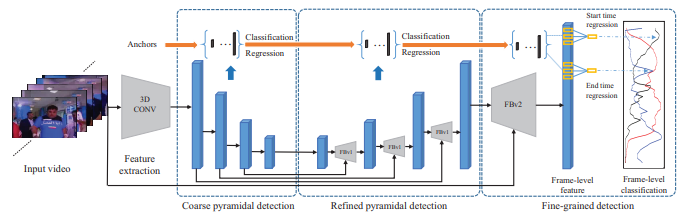

This repository is the introduction of "PBRNet:Progressive Boundary Refinement Network for Temporal Action Detection"(AAAI2020). They are designed for accurate and efficient temporal action detection. Initially, we implemented the framework by tensorflow and now we re-implement it by pytorch.

## Framework


## Prerequisites
python 3.6  <br>
pytorch 1.6  <br>
opencv-python 3.4.1 <br> 

## Data preparation
We first download the [THUMOS14](http://crcv.ucf.edu/THUMOS14/) datasets, then extract frames from videos by 10 fps. For optial flow extraction, we refer to [TV-L1](https://github.com/deepmind/kinetics-i3d/pull/5/files/f1fa01a332179e82cd655e7cd2f2f0c1c04f0c74) which only requires CPU. You can change the configurations based on your resources. 

## Pre-trained model
We refer to [kinetics_i3d_pytorch](https://github.com/hassony2/kinetics_i3d_pytorch) to get the pre-trained i3d model. 

## Training
```
CUDA_VISIBLE_DEVICES=$GPU_IDs python main.py
```

## Citation
```
@inproceedings{liu2020progressive,
  title={Progressive boundary refinement network for temporal action detection},
  author={Liu, Qinying and Wang, Zilei},
  booktitle={Proceedings of the AAAI Conference on Artificial Intelligence},
  year={2020}
}
```
